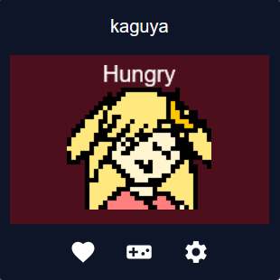

# Tamagotchi Web Extension
a tamagotchi pet in your browser! project for hack club #horizons

# Why I made this
I wanted to make something on the simple side for my first project, so I got the idea to make a browser extension game. This project is loosely based on the simple Tamagotchi Nano digital pet.

# How to play
## basic gameplay
Open the extension by clicking on its icon in the browser toolbar or extensions list.

Begin caring for the tamagotchi by pressing the hatch button and waiting (3s) for the pet to be born. Once born, the tamagotchi will start with empty food and happiness meters, which both have a maximum of 4 points. While fully hungry or fully sad, the color of the background will be bright red to show that the pet wants something. As well, the extension icon will have a red background. You can check the pet's needs by clicking on it. The pet begins in a baby state, shown by a grey background, during which it consumes food and happiness faster (4s and 3s respectively). It will grow up after a while (20s, consuming meter points every 8s and 6s). Clicking on the pet when the food and happiness are not empty will make the pet perform a close up.

All durations are sped up for testing and demonstration purposes. Closing and reopening the extension will not reset progress. Please keep the popup open while hatching (for now)! Also, there are currently no downsides to a hungry or sad pet.

## menu explanation
The heart icon is where you can raise the food and happiness bars. By clicking on it, a menu comes up where you can press the buttons to raise each bar by 1 point.

The functionality for the game icon is currently unimplemented.

The settings icon lets you pause the game or clear saved data. Interacting with the tamagotchi is unavailable while the game is paused

# Issues during development
 - As this was my first project, I had to learn many things from scratch and my code was very unorganized. I also forgot to split the javascript into multiple files. Because I couldn't understand what I wrote myself, debugging was difficult, but by using a lot of logging I slowly understood what caused issues.
 - I had trouble creating repeating tasks because closing the extension popup would stop execution and pausing would create delays. I created a function to determine the amount of time passed excluding pauses, but I'm sure there are still issues I haven't found.
 - I also procrastinated a lot...

## What to work on
 - Adding games to play with the pet
 - Adding sprites; currently everything is a placeholder
 - Creating a better design for the popup
 - Add more functionality from the real Tamagotchi
 - Organize code

# How this was made
AI has not been used in this project. This plugin was made with HTML, CSS, and JavaScript. Icons used are from Material UI icons by Google.

# web playable (demo)
Only available for Firefox currently. Please install Firefox to use the extension, sorry.

Get extension from https://riceballeater.github.io/tamagotchi-extension/. Click the link on the page to install.

~~Get extension from Firefox add-on store at https:\//addons.mozilla.org/en-CA/firefox/addon/tamagotchi-pet/.~~

# notes
 - this extension stores data locally that will persist when browsing data is cleared. to remove data, uninstall the extension or press the clear button in the settings.
